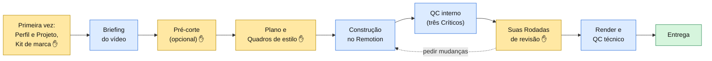

# Estúdio

**Um estúdio de edição de vídeo dentro do Claude.** O `estudio` é um plugin do Claude para quem grava vídeos curtos e edita sozinha, no pouco tempo que sobra: você grava, abre sua pasta no Claude e conversa com o **Diretor**. Ele lembra quem você é e como cada conta sua deve parecer (o **Kit de marca**), pergunta só o que falta, monta a edição por cima da sua gravação e para em cada etapa para você aprovar.

| | | |
|---|---|---|
|  |  |  |

**Para quem é:** a **Criadora**, uma criadora de conteúdo sem formação técnica que publica em mais de uma conta (a da empresa, a pessoal) e usa o Claude Desktop no Mac ou no Windows. Ela nunca abre um terminal nem clona um repositório.

## Como um vídeo anda pelo estúdio

Cada vídeo passa pela **Esteira**, sempre na mesma ordem. Nos pontos marcados com ✋ o Diretor para e espera a sua aprovação (ou registra uma aprovação automática, se você deu essa **Autonomia** a ele).



- **Amarelo:** etapas em que você decide. **Azul:** trabalho do estúdio. **Verde:** o vídeo pronto na pasta `entrega/`.
- A gravação original nunca é alterada: a edição é feita **por cima** dela, com o áudio original do começo ao fim.
- Formato padrão: **vertical 9:16** (Reels, TikTok, Shorts). Horizontal 16:9 só se você pedir.

## Dois níveis

| | **Nível 1: gratuito** | **Nível 2: com IA** |
|---|---|---|
| O que faz | legendas, textos animados, prints com zoom e marca-texto, tela dividida, gráficos, transições | tudo do Nível 1, mais imagens e vídeos gerados por IA: B-roll, ilustrações, metáforas visuais |
| Motor | [Remotion](https://www.remotion.dev), no seu computador | Remotion para montar; [Higgsfield](https://higgsfield.ai) para gerar imagens e vídeos |
| Custo | zero | créditos da sua conta Higgsfield. **Nada é gerado sem você aprovar o custo** (o portão de créditos), e o estúdio para se o gasto passar ~20% do estimado |
| Editor Higgsedit | não se aplica | só quando você pede, com aprovação de custo própria |
| Melhor para | dicas, tutoriais, bastidores, notícias | vídeos que pedem imagem de cinema ou ilustração |

## Instalar (passo a passo)

Você vai instalar o plugin uma vez. Depois disso ele **se atualiza sozinho** quando sai uma versão nova.

**Antes de começar:** você precisa do **Claude Desktop** (baixe em [claude.ai/download](https://claude.ai/download)) e de uma conta Claude com acesso ao **Claude Code** (plano Pro ou Max). O estúdio roda na aba **Code** do Claude Desktop, numa sessão **local**; ele não funciona no chat comum nem no Cowork.

### 1. Adicione o marketplace e instale o `estudio`

1. Abra o Claude Desktop e entre na aba **Code**.
2. Abra **Personalizar → Plugins** (em algumas versões, **Configurações → Plugins**).
3. Clique em **Adicionar marketplace** e cole o nome:

   ```text
   rodrigorjsf/studio
   ```

4. Na lista do marketplace **studio**, encontre **estudio** e clique em **Instalar**.

Os nomes dos menus podem mudar um pouco entre versões do Claude Desktop. Se não encontrar, procure a palavra **Plugins** nas configurações.

### 2. Crie a pasta do seu Estúdio

Escolha uma pasta **sua**, onde os vídeos vão morar. Uma pasta vazia é o ideal.

- **No Mac:** abra o **Finder**, entre em **Documentos**, clique com o botão direito → **Nova pasta** e dê o nome `Estúdio`.
- **No Windows:** abra o **Explorador de Arquivos**, entre em **Documentos**, clique com o botão direito → **Novo → Pasta** e dê o nome `Estúdio`.

Evite pastas sincronizadas com iCloud, OneDrive ou Google Drive: vídeos grandes sincronizando atrapalham a edição.

### 3. Abra a pasta e chame o Diretor

1. Na aba **Code**, escolha **abrir pasta** e selecione a pasta `Estúdio` que você criou. Deixe a sessão como **local**.
   - **No Windows:** use uma sessão local do Windows, não uma sessão dentro do WSL (lá os plugins não aparecem).
2. Digite:

   ```text
   /estudio:estudio
   ```

3. O Diretor cumprimenta você e pergunta se pode **preparar o seu computador** (baixa os programas de edição, cerca de 10 minutos, grátis). Não pede senha nem abre janelas; tudo fica guardado dentro do próprio plugin. Se preferir, responda "agora não" e volte depois.
4. Em seguida ele prepara a pasta e conduz duas conversas curtas, uma vez só: sobre **você** (Perfil) e sobre **cada conta** em que você publica (Projeto e Kit de marca).

Pronto: a partir daí, para cada vídeo novo, abra a mesma pasta e digite `/estudio:estudio` (ou `/estudio:novo-video`).

### 4. (Opcional) Conecte a Higgsfield para o Nível 2

1. No Claude Desktop, abra **Configurações → Conectores** (em algumas versões, **Personalizar → Conectores**).
2. Clique em **Adicionar conector personalizado**.
3. Nome: `Higgsfield`. URL: `https://mcp.higgsfield.ai/mcp`.
4. Clique em **Conectar** e entre na sua conta Higgsfield.

Não existe chave para copiar: o estúdio usa a sua conta pelo conector e nunca pede nem guarda senhas ou chaves.

### 5. (Opcional) Conecte o Notion

Se você já planeja no Notion, o Diretor pode **ler** as páginas que você indicar (nunca escreve nada lá). Em **Configurações → Conectores**, encontre **Notion**, clique em **Conectar** e entre com a sua conta.

### Desinstalar

Em **Personalizar → Plugins**, desinstale o **estudio**. Os programas que ele baixou para o computador saem junto. A pasta do seu Estúdio continua onde está, com seus vídeos e os arquivos do Remotion que ele colocou nela (a pasta `node_modules`, que você pode apagar se quiser liberar espaço).

## Comandos que você pode digitar

| Comando | Para quê |
|---|---|
| `/estudio:estudio` | começar ou continuar de onde parou |
| `/estudio:novo-video` | editar um vídeo novo |
| `/estudio:projetos` | ver seus Projetos, o que está em andamento e as métricas de cada um |
| `/estudio:editar-projeto` | mudar o briefing ou o Kit de marca de um Projeto |
| `/estudio:perfil` | mudar o seu Perfil e a sua Autonomia |

## Créditos

- Este projeto começou como um fork de [mackswendhell/studio](https://github.com/mackswendhell/studio), de Macks Wendhell (MIT), e diverge dele livremente. Os guias, a persona do diretor de vídeo e os exemplos de estilo vêm de lá.
- As imagens da galeria de estilos que vêm de vídeos do canal **Macks Wendhell | Inteligência Aplicada** são referência visual; não as reutilize como material próprio.
- O amostrador de quadros (`plugin/estudio/scripts/frames/`) é copiado do projeto [claude-video](https://github.com/bradautomates/claude-video), de Bradley Bonanno (MIT).
- As regras do Remotion do plugin foram escritas com base nas orientações de boas práticas do próprio [Remotion](https://github.com/remotion-dev/remotion) (`packages/skills`), sem copiar o texto.
- [Remotion](https://www.remotion.dev): gratuito para pessoas físicas, organizações sem fins lucrativos e empresas com até 3 pessoas; empresas maiores precisam de [licença](https://www.remotion.dev/license).
- Transcrição local: [faster-whisper](https://github.com/SYSTRAN/faster-whisper).
- Higgsfield e Notion: serviços de terceiros, sujeitos aos próprios termos e preços.

O detalhe de cada peça de terceiros, com commit e licença, está em [plugin/estudio/THIRD_PARTY.md](plugin/estudio/THIRD_PARTY.md). Licença do repositório: [MIT](LICENSE).

## Para quem mantém o plugin

O guia de desenvolvimento (estrutura do repositório, testes, convenções e como publicar uma versão) está em **[docs/developer-guide.md](docs/developer-guide.md)**.
