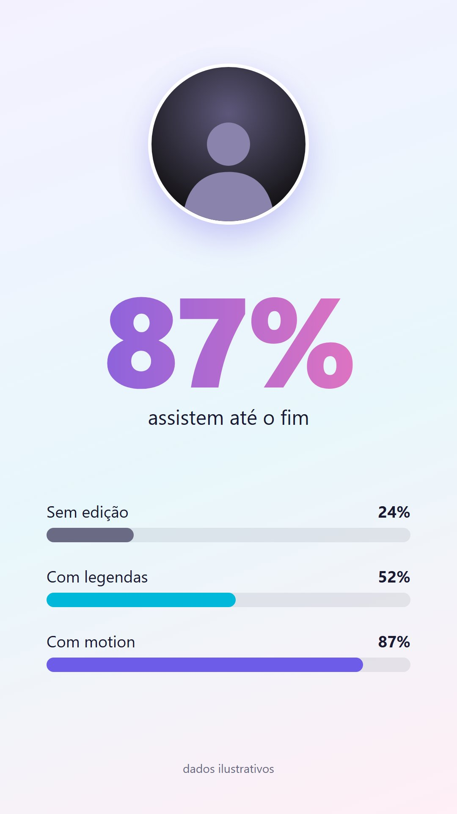
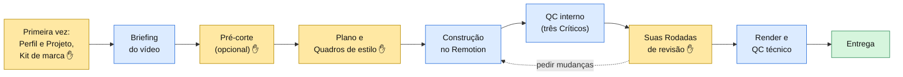

# Estúdio

**Um estúdio de edição de vídeo dentro do Claude.** O `estudio` é um plugin do Claude para quem grava vídeos curtos e edita sozinha, no pouco tempo que sobra: você grava, abre sua pasta no Claude e conversa com o **Diretor**. Ele lembra quem você é e como cada conta sua deve parecer (o **Kit de marca**), pergunta só o que falta, monta a edição por cima da sua gravação e para em cada etapa para você aprovar.

| | | |
|---|---|---|
|  |  |  |

**Para quem é:** a **Criadora**, uma criadora de conteúdo sem formação técnica que publica em mais de uma conta (a da empresa, a pessoal) e usa o Claude Desktop no Mac ou no Windows. Ela nunca abre um terminal nem clona um repositório.

## Como um vídeo anda pelo estúdio

Cada vídeo passa pela **Esteira**, sempre na mesma ordem. Nos pontos marcados com ✋ o Diretor para e espera a sua aprovação (ou registra uma aprovação automática, se você deu essa **Autonomia** a ele).



- **Amarelo:** etapas em que você decide. **Azul:** trabalho do estúdio. **Verde:** o vídeo pronto na pasta `entrega/`.
- A gravação original nunca é alterada: a edição é feita **por cima** dela, com o áudio original do começo ao fim.
- Formato padrão: **vertical 9:16** (Reels, TikTok, Shorts). Horizontal 16:9 só se você pedir.

## Quem trabalha em cada etapa

O estúdio é uma equipe. **Só o Diretor fala com você**; as outras **personas** trabalham entre os Gates e nunca te perguntam nada. Toda peça de trabalho passa por um **Crítico** que não é o Autor dela antes de chegar até você, e os Críticos só aprovam ou reprovam: nunca editam.

### Quem é quem

Duas personas trabalham na conversa com você (são *skills*, rodando na thread principal do Claude) e onze são agentes que o Diretor chama e que devolvem um relatório. A coluna **Nível** diz se a persona trabalha no Nível 1, no Nível 2 ou nos dois.

| Persona | Tipo | Etapa da Esteira | O que faz | Quem chama | O que devolve | Se aprova | Se reprova ou falha | Nível |
|---|---|---|---|---|---|---|---|---|
| **Diretor** | skill `estudio` (e as skills `novo-video`, `plano` e `edicao`, que são o mesmo Diretor em cada etapa) | todas, da abertura à Entrega | conversa com você em português, roda cada Gate, conta as Rodadas e junta as suas notas numa lista só; lê o **Caderno** no começo de cada sessão e é o único que escreve nele | você, com `/estudio:estudio` | perguntas curtas, o estado do Vídeo e o próximo passo | registra a aprovação e passa o Vídeo para a etapa seguinte | devolve o trabalho a quem o fez, com as suas notas ou os motivos do Crítico; depois de 3 reprovações seguidas de um Crítico, pergunta a você | 1 e 2 |
| **Entrevistador** | skill `perfil` (e as skills `novo-projeto` e `editar-projeto`, além do briefing de cada Vídeo) | primeira vez (Perfil, Projeto e Kit de marca) e briefing de cada Vídeo | faz o Grilling: as perguntas que definem quem você é, como cada conta deve parecer e o que cada Vídeo pede | você, ou o Diretor quando falta o Perfil ou o Projeto | `perfil.md`, `projeto.md` e o Kit de marca, ou `video.md` | o Kit passa pelo Gate e o Projeto fica pronto para receber Vídeos | se um documento não valida, corrige o próprio arquivo; no Gate do Kit, volta aos tópicos que você aponta | 1 e 2 |
| **Assistente de edição** | agente `assistente-de-edicao` | Briefing (assistir e transcrever) | transcreve a fala com o tempo de cada palavra, assiste à sua gravação e mede a Zona do rosto | o Diretor, em segundo plano, enquanto você responde o briefing | a transcrição, a Zona do rosto e a lista de Prints que ajudariam | sem Gate: o Diretor confere no `estado` que a transcrição e a Zona do rosto existem e passa o Vídeo ao Plano | para no primeiro passo que falha e relata o erro exato; o que já foi feito fica, e o Diretor avisa você e oferece tentar de novo | 1 e 2 |
| **Editor de pré-corte** | agente `editor-de-pre-corte` | Briefing (opcional) | propõe quais silêncios, repetições e tropeços cortar, sempre entre duas palavras, sem cortar nada | o Diretor, só se você aceitar o Pré-corte ou pedir | a proposta de cortes, com o tempo e o motivo de cada um | o Diretor mostra a lista, você aprova e só então o estúdio corta: o resultado vira o novo Master | se você cancela, nada é cortado e o Original segue como Master; se você tira algum corte, o trecho volta ao Vídeo | 1 e 2 |
| **Roteirista-estrategista** | agente `roteirista-estrategista` | Planejamento | escreve o Plano: duas ou três direções (uma recomendada) e cenas que começam cada uma numa Palavra-gatilho, com o tempo esperado e, no Nível 2, os créditos | o Diretor | o Plano (`plano.json`) e um relatório | o Guardião da marca e o Revisor de plataforma julgam o Plano; se aprovam, ele segue para os Quadros e para o seu Gate | refaz sozinho quando a checagem do estúdio ou um Crítico reprova, sem incomodar você; refaz também com as suas notas quando você pede mudanças | 1 e 2 |
| **Diretor de arte** | agente `diretor-de-arte` | Planejamento (Quadros de estilo) | renderiza dois ou três Quadros de estilo: quadros reais do seu vídeo com as cores, fontes e legendas do Kit por cima | o Diretor | os Quadros, registrados no Plano | o Guardião da marca e o Revisor de plataforma julgam os Quadros; se aprovam, você os vê no Gate | refaz o que a checagem ou um Crítico reprova, sem incomodar você | 1 e 2 |
| **Motion designer** | agente `motion-designer` | Construção e Ajustes | monta a edição no Remotion por cima do seu Master, com o áudio original uma vez só, e renderiza a versão completa e os stills de cada versão (v01, v02…) | o Diretor | o render completo e os stills da versão, e um relatório | os três Críticos aprovam a versão e só então você vê os stills | corrige o que os Críticos reprovam sem avisar você; em Ajustes, aplica todas as suas notas e nada além delas | 1 e 2 |
| **Guardião da marca** (Crítico) | agente `guardiao-da-marca` | QC interno: Plano, Quadros de estilo e cada versão | confere cores, fontes, logo, legendas, movimento e a lista de fazer e evitar contra o Kit | o Diretor | veredito `aprovado` ou `reprovado`, com um motivo por problema | com os outros Críticos aprovando, o trabalho avança até você | os motivos voltam, palavra por palavra, ao Autor do trabalho; nunca conserta nada | 1 e 2 |
| **Revisor de plataforma** (Crítico) | agente `revisor-de-plataforma` | QC interno: Plano, Quadros de estilo e cada versão | confere se o texto fica na Área livre, se os primeiros segundos prendem quem assiste e se a legenda é legível no celular | o Diretor | veredito `aprovado` ou `reprovado`, com um motivo por problema | com os outros Críticos aprovando, o trabalho avança até você | os motivos voltam, palavra por palavra, ao Autor do trabalho; nunca conserta nada | 1 e 2 |
| **QC técnico** (Crítico) | agente `qc-tecnico` | QC interno (cada versão renderizada) e antes da Entrega (cada arquivo) | mede o render contra o Master: duração, resolução, 30 quadros por segundo, uma só faixa de áudio, volume, quadros pretos e congelados | o Diretor | veredito `aprovado` ou `reprovado`, com cada checagem que falhou; o teste de flashes fica para uma pessoa | a versão segue para a sua revisão, ou os arquivos seguem para a Entrega | na versão, os motivos voltam ao Motion designer; nos arquivos da Entrega, um render refazível volta ao Finalizador e um problema na edição volta ao Motion designer | 1 e 2 |
| **Finalizador** | agente `finalizador` | Entrega | renderiza o MP4 (vertical 9:16 por padrão) e, se você pediu, o 16:9, o quadrado e as sobreposições em MOV | o Diretor, depois que você aprova uma versão | os arquivos na pasta `entrega/` | o QC técnico aprova cada arquivo, o estúdio confere todos contra o Master e o Vídeo vira Entregue | refaz uma vez o que é dele (render que parou, Formato errado); se o problema está na edição, é do Motion designer | 1 e 2 |
| **Artista generativo** | agente `artista-generativo` | Construção, antes da primeira versão | gera as imagens e os clipes que o Plano pede na Higgsfield, sem texto dentro, cada geração liberada pelo estúdio antes de ser paga | o Diretor, só depois do Gate de créditos | os arquivos em `gerados/` e o gasto contra o estimado | o Motion designer monta a edição com eles | para quando o gasto passaria de 20% acima do aprovado (o Diretor pergunta a você) e para, relatando, quando o saldo não cobre | 2 |
| **Montador Higgsedit** | agente `montador-higgsedit` | Construção, só a pedido | monta no Higgsedit (o editor da Higgsfield) o trecho, ou o Vídeo inteiro, que você pediu por um efeito que só ele tem | o Diretor, só depois do seu pedido e do Gate de custo do Higgsedit | o arquivo em `higgsedit/` e o gasto contra o estimado | passa pelos mesmos Críticos e pelo mesmo QC técnico de qualquer versão | para no limite de +20% e o Diretor pergunta a você; se o Higgsedit não faz o que você pediu, diz isso e propõe o mais parecido no Remotion | 2 |

### Como o trabalho anda entre eles

O diagrama mostra a cadeia de chamadas: quem chama quem, cada Gate (losango amarelo com ✋), o caminho de aprovar e o de reprovar. Amarelo é você decidindo, azul é trabalho do estúdio e verde é a Entrega.

```mermaid
flowchart TD
  C(["Criadora"]) -->|"/estudio:estudio"| D["Diretor<br/>fala com você e roda cada Gate"]

  D --> GP{"Preparação do computador ✋"}
  GP -->|"agora não"| SEM["Segue sem preparar e oferece<br/>de novo na hora de editar"]
  SEM --> GE
  GP -->|"sim"| GE{"Criar o Estúdio ✋"}
  GE -->|"agora não"| PARA["Para aqui: você volta<br/>com /estudio:estudio"]
  GE -->|"sim"| ENT["Entrevistador<br/>Perfil, Projeto e Kit de marca"]
  ENT --> GK{"Kit de marca ✋"}
  GK -->|"pedir mudanças"| ENT
  GK -->|"aprovar"| BRF["Diretor e Entrevistador<br/>briefing do Vídeo e Nível"]
  GK -->|"aprovar"| ASS["Assistente de edição<br/>transcreve e mede a Zona do rosto"]

  BRF --> GPC{"Pré-corte ✋<br/>opcional, padrão não"}
  ASS --> GPC
  GPC -->|"sim"| EPC["Editor de pré-corte<br/>propõe os cortes"]
  EPC --> GPA{"Cortes ✋"}
  GPA -->|"aprova, todos ou alguns"| NM["Corte feito: novo Master<br/>Original guardado"]
  GPA -->|"cancela"| MO["Master = Original"]
  GPC -->|"não"| MO

  NM --> RP["Roteirista-estrategista<br/>escreve o Plano"]
  MO --> RP
  RP --> CP{"Guardião da marca e<br/>Revisor de plataforma<br/>aprovam o Plano?"}
  CP -->|"reprovam: motivos<br/>sem avisar você"| RP
  CP -->|"3 reprovações seguidas"| ESC1{"Diretor pergunta a você ✋<br/>ver o Plano assim mesmo ou<br/>seguir uma direção sua"}
  ESC1 -->|"uma direção sua"| RP
  ESC1 -->|"ver assim mesmo"| DA
  CP -->|"aprovam"| DA["Diretor de arte<br/>renderiza os Quadros de estilo"]
  DA --> CQ{"Guardião da marca e<br/>Revisor de plataforma<br/>aprovam os Quadros?"}
  CQ -->|"reprovam: motivos<br/>sem avisar você"| DA
  CQ -->|"3 reprovações seguidas"| ESC2{"Diretor pergunta a você ✋<br/>ver os Quadros assim mesmo ou<br/>seguir uma direção sua"}
  ESC2 -->|"uma direção sua"| DA
  ESC2 -->|"ver assim mesmo"| GPL
  CQ -->|"aprovam"| GPL{"Plano e Quadros ✋<br/>dois Gates se o Kit deixou<br/>o estilo em aberto"}
  GPL -->|"Autonomia alta"| AUTO["Diretor aprova por você,<br/>conta e registra"]
  GPL -->|"pedir mudanças<br/>com as suas notas"| RP
  GPL -->|"aprovar"| NV{"Nível do Vídeo"}
  AUTO --> NV

  NV -->|"Nível 1"| MD
  NV -->|"Nível 2"| GC{"Créditos ✋<br/>custo, saldo e orçamento"}
  GC -->|"aprovar"| AG["Artista generativo<br/>gera imagens e clipes"]
  GC -->|"saldo curto ou acima<br/>do orçamento: cortar<br/>cenas geradas"| RP
  AG -->|"passaria de +20%"| GO{"Novo total de créditos ✋"}
  GO -->|"aprovar novo total"| AG
  GO -->|"seguir sem o que falta"| MD
  GO -->|"parar"| PAR["Geração parada:<br/>nada mais é gerado"]
  AG --> MD

  MD["Motion designer<br/>monta no Remotion e<br/>renderiza a versão vNN"] --> QI{"QC técnico, Guardião da marca<br/>e Revisor de plataforma<br/>aprovam a versão?"}
  QI -->|"algum reprova, até 3 turnos:<br/>motivos sem avisar você"| MD
  QI -->|"3 reprovações seguidas"| ESC{"Diretor pergunta a você ✋<br/>ver assim mesmo ou<br/>seguir uma direção sua"}
  ESC -->|"uma direção sua"| MD
  ESC -->|"ver assim mesmo"| REV
  QI -->|"os três aprovam"| REV{"Sua revisão ✋<br/>Rodada N, sempre sua"}
  REV -->|"pedir mudanças<br/>notas numa lista, nova Rodada"| MD

  PED["Você pede um efeito<br/>só do Higgsedit"] --> GH{"Custo do Higgsedit ✋"}
  GH -->|"aprovar"| MH["Montador Higgsedit<br/>monta o trecho ou o Vídeo"]
  GH -->|"manter no Remotion"| MD
  MH -->|"um trecho"| MD
  MH -->|"o Vídeo inteiro"| QI

  REV -->|"aprovar ou aprovar<br/>com pequenos ajustes"| FIN["Finalizador<br/>renderiza os arquivos"]
  FIN --> QCE{"QC técnico<br/>aprova cada arquivo?"}
  QCE -->|"render refazível"| FIN
  QCE -->|"problema na edição"| MD
  QCE -->|"3 reprovações seguidas"| ESC3{"Diretor pergunta a você ✋<br/>seguir uma direção sua"}
  ESC3 -->|"uma direção sua"| MD
  QCE -->|"aprova"| ENTR(["Entrega<br/>pasta entrega/"])
  ENTR --> GL{"Aprendizados do Kit ✋"}
  GL -->|"os que você aprovar, ou nenhum"| ARQ(["Vídeo arquivado"])

  classDef ela fill:#FFE8A3,stroke:#B58A00,color:#111
  classDef estudio fill:#DCEBFF,stroke:#2A6FDB,color:#111
  classDef fim fill:#D6F5DD,stroke:#2E8B57,color:#111
  class C,GP,GE,GK,GPC,GPA,GPL,GC,GO,ESC,ESC1,ESC2,ESC3,REV,GH,GL,PED ela
  class D,SEM,PARA,PAR,ENT,BRF,ASS,EPC,NM,MO,RP,CP,DA,CQ,AUTO,NV,AG,MD,QI,MH,FIN,QCE estudio
  class ENTR,ARQ fim
```



- **Loop interno dos Críticos.** Antes de você ver qualquer coisa, os Críticos julgam o trabalho. Se algum reprova, os motivos voltam ao Autor e você não é avisada. Depois de **3 reprovações seguidas** o loop desiste: o Diretor te faz uma pergunta em uma frase, com duas opções (ver assim mesmo, ou seguir uma direção sua), e uma direção sua abre três turnos novos.
- **Autonomia.** Com a Autonomia **alta**, o Diretor aprova por você o Gate do Plano e dos Quadros, e sempre te conta e deixa registrado. Créditos, Higgsedit, Pré-corte, Kit de marca, a sua revisão da edição e os aprendizados do Kit **nunca** são aprovados automaticamente.
- **Caderno.** O estúdio lembra como trabalhar com você. Cada Estúdio tem um **Caderno** (sobre você e o seu computador) e cada Projeto tem o seu (sobre aquela conta), cada um com três seções: **Elogios** (o que você gostou, para continuar fazendo), **Queixas** (o que você não gostou, para parar de fazer) e **Soluções** (um problema já resolvido no seu computador, para não travar de novo). É texto em português que você pode abrir: `caderno.md` na pasta do Estúdio e na pasta de cada Projeto. **Só o Diretor escreve**: quando você diz o que gostou ou não, ele anota e te conta em uma linha; quando algo novo contradiz uma anotação antiga, ele pergunta qual fica; se uma Queixa contradiz o seu Kit de marca, ele oferece um aprendizado do Kit. Toda persona recebe os dois Cadernos junto com o Kit e lê antes de trabalhar, e pode propor anotações no relatório que devolve, que o Diretor decide. O Caderno nunca muda o Kit de marca.
- **Nível 2.** O Gate de créditos vem depois do Plano e antes de qualquer geração. O Higgsedit só entra se você pedir, com um Gate de custo próprio.

### Os Gates

Um **Gate** é um ponto em que o trabalho para até você (ou a sua Autonomia) aprovar.

| Gate | O que você vê | O que a aprovação libera | O que a rejeição faz | A Autonomia aprova? |
|---|---|---|---|---|
| **Preparação do computador** | a pergunta "Posso preparar seu computador para editar vídeos? (~2 GB, ~15 min, grátis)", com "sim" e "agora não" | o estúdio baixa, uma única vez, os programas de edição e o modelo de fala (cerca de 2 GB) para uma pasta reservada do plugin, sem senha e sem abrir janelas; depois disso, transcrever um vídeo não precisa de internet | "agora não": todo o resto continua funcionando; a pergunta volta quando você for editar um Vídeo e na próxima sessão | Não |
| **Criar o Estúdio** | a pergunta se a pasta aberta pode virar o seu Estúdio (um arquivo marcador, a pasta `projetos` e os arquivos do Remotion), dizendo que os seus arquivos ficam como estão | cria o Estúdio e segue para o Perfil e o Projeto | "agora não": o Diretor diz que você volta com `/estudio:estudio` quando quiser e para | Não |
| **Kit de marca** | um resumo em português simples do Kit: Formato, cores, fontes, legendas, movimento, música, entregáveis, orçamento de créditos, referências e o que fazer e evitar | o Projeto fica pronto para receber Vídeos; até lá nenhum Vídeo começa nele | "pedir mudanças" volta aos tópicos que você nomeia; "aprovar com pequenos ajustes" aplica e mostra só o que mudou. Mudar um Kit já aprovado (`/estudio:editar-projeto`) também só vale com o seu "aplicar" | Não |
| **Pré-corte** | primeiro o aviso, só quando a gravação parece sem cortes (quantas pausas e quantos segundos), com "não" como padrão; se você aceitar, a lista de cortes com tempo, motivo e o que é dito | os cortes aprovados viram um novo Master; o Original fica guardado intacto | "não" ou "cancelar": nada é cortado; se você tira um corte, o trecho volta ao Vídeo | Não |
| **Plano e Quadros** (Gate único, quando o Kit já define o estilo) | as direções (a recomendada primeiro), a tabela de cenas com a palavra que dispara cada uma, os seus pedidos, o tempo esperado e os Quadros de estilo | o Vídeo passa a Construção e a edição começa | "pedir mudanças": as suas notas, numa lista só, voltam ao Roteirista-estrategista, a checagem e os Críticos rodam de novo e o Gate reabre; uma ideia nova, e não um ajuste, custa mais tempo e o Diretor avisa | Sim, só com Autonomia alta: o Diretor aprova, te conta e registra |
| **Plano, depois Quadros** (dois Gates, quando o Kit deixou o estilo em aberto) | primeiro o Plano; depois dois ou três Quadros, cada um propondo uma opção do estilo em aberto | o Plano libera os Quadros; os Quadros liberam a Construção, e o look que você escolheu vai para "O que muda do Kit" | as suas notas voltam ao trabalho, os Críticos julgam de novo e o Gate reabre | Sim, só com Autonomia alta, um Gate de cada vez |
| **Créditos** (Nível 2) | o custo estimado ao lado do seu saldo na Higgsfield, junto do Plano | o Artista generativo pode gerar imagens e clipes | o saldo não cobre (o Diretor diz quantos créditos faltam) ou o custo passa do orçamento do Kit: nada muda, e ou o Roteirista-estrategista corta cenas geradas, ou você recarrega, ou sobe o orçamento com `/estudio:editar-projeto`. Recusar o custo faz parte do "pedir mudanças" do Gate do Plano. Nada é gerado sem aprovação | Não |
| **Novo total de créditos** (Nível 2) | o que já foi gerado, o que falta e quanto custa, quando a geração parou no limite de +20% | a geração continua com o novo total aprovado | "seguir sem o que falta" fecha o Gate e o Motion designer monta sem aquelas imagens, com a geração parada; "parar" encerra | Não |
| **Custo do Higgsedit** (Nível 2, só a pedido) | o custo estimado ao lado do seu saldo, e o aviso de que é uma mudança de escopo | o Montador Higgsedit monta o trecho ou o Vídeo que você pediu | "manter no Remotion": a edição continua no Remotion, sem custo | Não |
| **Escalada dos Críticos** | uma frase com o que os Críticos e o Autor não conseguiram resolver, e duas opções: ver assim mesmo ou seguir uma direção sua | "ver assim mesmo" abre a sua revisão (ou mostra o Plano ou os Quadros como estão); "uma direção sua" passa o que você disse ao Autor | uma direção sua reabre o loop com três turnos novos. A mesma regra vale no Plano, nos Quadros, na versão e no QC técnico da Entrega | Não |
| **Sua revisão** (Rodadas) | os stills da versão vNN, com o momento e o que cada um mostra; nas Rodadas seguintes, como cada nota anterior foi aplicada | "aprovar" ou "aprovar com pequenos ajustes" (aplicados antes do render, sem nova Rodada) libera o render final e a Entrega | "pedir mudanças": as suas notas viram uma lista só, uma ideia nova entra como mudança de escopo, e o Motion designer faz uma nova versão numa nova Rodada. É sempre sua: com Autonomia alta o Diretor para aqui para você ver o vídeo antes do final | Não |
| **Aprendizados do Kit** (depois da Entrega) | até três aprendizados do Vídeo, cada um com "antes → depois", mais a opção "nenhum" | só os que você aprova entram no Kit, valendo para os próximos Vídeos | "nenhum" (ou "decide você"): o Kit não muda e o Vídeo é arquivado do mesmo jeito | Não |

## Dois níveis

| | **Nível 1: gratuito** | **Nível 2: com IA** |
|---|---|---|
| O que faz | legendas, textos animados, prints com zoom e marca-texto, tela dividida, gráficos, transições | tudo do Nível 1, mais imagens e vídeos gerados por IA: B-roll, ilustrações, metáforas visuais |
| Motor | [Remotion](https://www.remotion.dev), no seu computador | Remotion para montar; [Higgsfield](https://higgsfield.ai) para gerar imagens e vídeos |
| Custo | zero | créditos da sua conta Higgsfield. **Nada é gerado sem você aprovar o custo** (o portão de créditos), e o estúdio para se o gasto passar ~20% do estimado |
| Editor Higgsedit | não se aplica | só quando você pede, com aprovação de custo própria |
| Melhor para | dicas, tutoriais, bastidores, notícias | vídeos que pedem imagem de cinema ou ilustração |

## Instalar (passo a passo)

Você vai instalar o plugin uma vez. Depois disso ele **se atualiza sozinho** quando sai uma versão nova.

**Antes de começar:** você precisa do **Claude Desktop** (baixe em [claude.ai/download](https://claude.ai/download)) e de uma conta Claude com acesso ao **Claude Code** (plano Pro ou Max). O estúdio roda na aba **Code** do Claude Desktop, numa sessão **local**; ele não funciona no chat comum nem no Cowork.

### 1. Adicione o marketplace e instale o `estudio`

1. Abra o Claude Desktop e entre na aba **Code**.
2. Abra **Personalizar → Plugins** (em algumas versões, **Configurações → Plugins**).
3. Clique em **Adicionar marketplace** e cole o nome:

   ```text
   rodrigorjsf/studio
   ```

4. Na lista do marketplace **studio**, encontre **estudio** e clique em **Instalar**.

Os nomes dos menus podem mudar um pouco entre versões do Claude Desktop. Se não encontrar, procure a palavra **Plugins** nas configurações.

### 2. Crie a pasta do seu Estúdio

Escolha uma pasta **sua**, onde os vídeos vão morar. Uma pasta vazia é o ideal.

- **No Mac:** abra o **Finder**, entre em **Documentos**, clique com o botão direito → **Nova pasta** e dê o nome `Estúdio`.
- **No Windows:** abra o **Explorador de Arquivos**, entre em **Documentos**, clique com o botão direito → **Novo → Pasta** e dê o nome `Estúdio`.

Evite pastas sincronizadas com iCloud, OneDrive ou Google Drive: vídeos grandes sincronizando atrapalham a edição.

### 3. Abra a pasta e chame o Diretor

1. Na aba **Code**, escolha **abrir pasta** e selecione a pasta `Estúdio` que você criou. Deixe a sessão como **local**.
   - **No Windows:** use uma sessão local do Windows, não uma sessão dentro do WSL (lá os plugins não aparecem).
2. Digite:

   ```text
   /estudio:estudio
   ```

3. O Diretor cumprimenta você e pergunta se pode **preparar o seu computador** (baixa uma única vez os programas de edição e o modelo de fala, cerca de 2 GB e 15 minutos, grátis). Não pede senha nem abre janelas; tudo fica guardado dentro do próprio plugin. Se preferir, responda "agora não" e volte depois.
4. Em seguida ele prepara a pasta e conduz duas conversas curtas, uma vez só: sobre **você** (Perfil) e sobre **cada conta** em que você publica (Projeto e Kit de marca).

Pronto: a partir daí, para cada vídeo novo, abra a mesma pasta e digite `/estudio:estudio` (ou `/estudio:novo-video`).

### 4. (Opcional) Conecte a Higgsfield para o Nível 2

1. No Claude Desktop, abra **Configurações → Conectores** (em algumas versões, **Personalizar → Conectores**).
2. Clique em **Adicionar conector personalizado**.
3. Nome: `Higgsfield`. URL: `https://mcp.higgsfield.ai/mcp`.
4. Clique em **Conectar** e entre na sua conta Higgsfield.

Não existe chave para copiar: o estúdio usa a sua conta pelo conector e nunca pede nem guarda senhas ou chaves.

### 5. (Opcional) Conecte o Notion

Se você já planeja no Notion, o Diretor pode **ler** as páginas que você indicar (nunca escreve nada lá). Em **Configurações → Conectores**, encontre **Notion**, clique em **Conectar** e entre com a sua conta.

### Desinstalar

Em **Personalizar → Plugins**, desinstale o **estudio**. Os programas que ele baixou para o computador saem junto. A pasta do seu Estúdio continua onde está, com seus vídeos e os arquivos do Remotion que ele colocou nela (a pasta `node_modules`, que você pode apagar se quiser liberar espaço).

## Comandos que você pode digitar

| Comando | Para quê |
|---|---|
| `/estudio:estudio` | começar ou continuar de onde parou |
| `/estudio:novo-video` | editar um vídeo novo |
| `/estudio:projetos` | ver seus Projetos, o que está em andamento e as métricas de cada um |
| `/estudio:editar-projeto` | mudar o briefing ou o Kit de marca de um Projeto |
| `/estudio:perfil` | mudar o seu Perfil e a sua Autonomia |

## Créditos

- Este projeto começou como um fork de [mackswendhell/studio](https://github.com/mackswendhell/studio), de Macks Wendhell (MIT), e diverge dele livremente. Os guias, a persona do diretor de vídeo e os exemplos de estilo vêm de lá.
- As imagens da galeria de estilos que vêm de vídeos do canal **Macks Wendhell | Inteligência Aplicada** são referência visual; não as reutilize como material próprio.
- O amostrador de quadros (`plugin/estudio/scripts/frames/`) é copiado do projeto [claude-video](https://github.com/bradautomates/claude-video), de Bradley Bonanno (MIT).
- As regras do Remotion do plugin foram escritas com base nas orientações de boas práticas do próprio [Remotion](https://github.com/remotion-dev/remotion) (`packages/skills`), sem copiar o texto.
- [Remotion](https://www.remotion.dev): gratuito para pessoas físicas, organizações sem fins lucrativos e empresas com até 3 pessoas; empresas maiores precisam de [licença](https://www.remotion.dev/license).
- Transcrição local: [faster-whisper](https://github.com/SYSTRAN/faster-whisper).
- Higgsfield e Notion: serviços de terceiros, sujeitos aos próprios termos e preços.

O detalhe de cada peça de terceiros, com commit e licença, está em [plugin/estudio/THIRD_PARTY.md](plugin/estudio/THIRD_PARTY.md). Licença do repositório: [MIT](LICENSE).

## Para quem mantém o plugin

O guia de desenvolvimento (estrutura do repositório, testes, convenções e como publicar uma versão) está em **[docs/developer-guide.md](docs/developer-guide.md)**.
