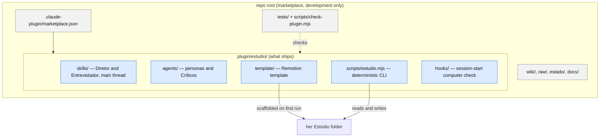

# Developer guide

For the maintainer of the `estudio` plugin. The Criadora-facing overview and install guide is the
[README](../README.md); the vocabulary is [CONTEXT.md](../CONTEXT.md); the decisions are the ADRs in
[docs/adr/](adr/).

## What this repo is

The repo root is a Claude plugin **marketplace** (`.claude-plugin/marketplace.json`, name `studio`)
that publishes one plugin, `estudio`, from `plugin/estudio/` (ADR 0005). Publishing a new version is
a push: bump `version` in `plugin/estudio/.claude-plugin/plugin.json` and push to `main`; installed
copies update themselves.

- **Only `plugin/estudio/` ships.** `wiki/`, `raw/`, `estado/`, `PROJETO.md`, `GLOSSARIO.md`,
  `ROADMAP.md`, `tests/` and `docs/` stay out of the package (`scripts/check-plugin.mjs` rejects
  them inside it).
- **The Criadora's data never lives in the plugin** (its root is replaced on every update). It lives
  in her Estúdio folder, marked by `estudio.json`; the layout is documented at the top of
  `plugin/estudio/scripts/lib/layout.mjs`.
- `docs/archive/hf_api.py` is the upstream Higgsfield Cloud API-key script, kept for reference only.
  ADR 0002 dropped that path; nothing runs it and the package may not name it.

## Commands

Each `npm` script body also runs directly with `node`, for machines where `npm` itself fails.

| What | Command |
|---|---|
| Full test suite | `node --test "tests/**/*.test.mjs"` (`npm test`; add `--test-concurrency=1` when the render tests contend) |
| Typecheck (TypeScript + split-layout guard) | `tsc --noEmit -p tsconfig.json && node scripts/check-split-layouts.mjs` (`npm run typecheck`) |
| Plugin structure check | `node scripts/check-plugin.mjs .` |
| Validate with Claude Code | `claude plugin validate --strict --json .` and `… plugin/estudio` |
| Mirror the speech model on the GitHub Release (maintainer; publishing is outward, see the script header) | `sh scripts/espelhar-modelo.sh [--dry-run]` |
| Try the plugin locally | `claude --plugin-dir plugin/estudio`, then `/estudio:estudio` in an empty folder |

Tests that need ffmpeg, Python, `node_modules` or the `claude` CLI skip with the reason when those
are missing; the skip count is not a failure.

## Test seams (spec #1, Testing Decisions)

1. **The deterministic CLI** (`plugin/estudio/scripts/estudio.mjs`: `estado`, `qc`, `precorte`, `caderno` and
   the Gate commands), driven with fixture Estúdio folders and synthetic ffmpeg clips.
2. **The Remotion template**: typecheck plus still renders that prove the Kit reaches the frame.
3. **The plugin structure**: `scripts/check-plugin.mjs`, covered by `tests/plugin-structure.test.mjs`.

A good test drives one of these public entry points and asserts only on observable output (JSON,
files, exit codes), never on prompt wording.

## Conventions the structure check enforces

- **Personas** (`plugin/estudio/agents/*.md`) pin a full model ID (`claude-…`) and an explicit
  `effort`, declare a `tools` allowlist, and declare a display `color` (one of `red`, `blue`,
  `green`, `yellow`, `purple`, `orange`, `pink`, `cyan`). Colors group the Esteira stages: cyan
  ingest and Pré-corte, purple Plano and Quadros de estilo, blue the Remotion build, orange the two
  personas that spend Higgsfield credits, green render and Entrega, and one warm color per Crítico
  (red QC técnico, yellow Guardião da marca, pink Revisor de plataforma), because the three run side
  by side.
- **Skills** (`plugin/estudio/skills/*/SKILL.md`) pin the same way: `model: claude-opus-5-5` and
  `effort: medium`, the spec's setting for the Diretor and the Entrevistador on the main thread.
- **Críticos** (`qc-tecnico`, `guardiao-da-marca`, `revisor-de-plataforma`) hold no editing tool.
- **Self-contained package**: every relative link resolves inside `plugin/estudio/`; skills call
  scripts through `${CLAUDE_PLUGIN_ROOT}`.
- **Notion is read-only**: only `notion-fetch`, no Notion server, no persona with a Notion tool.
- **No Higgsfield API-key path** (`HF_KEY`, `HF_API_KEY`, `HF_API_SECRET`, `hf_api.py`).
- **No upstream leftovers**: the package never names the upstream `edicoes/`, `guias/` or
  `tools/*.py` paths, `npm run instalar`, or a `ticket #N` marker. It describes the plugin, not
  the repo it was forked from.
- **Preparação host list**: every literal https host in `scripts/instalar.sh`, `scripts/instalar.ps1`
  and the `vendor.json` file URLs is in `plugin/estudio/hosts.json`, and no Hugging Face host is.
  The Diretor hands that list to the Criadora when a download is blocked by her cloud workspace.
- Size cap: 5,000 files and 200 MB.

## Language

Conversation with the Criadora and every file she reads are pt-BR; skill bodies, agent prompts,
code, tests, ADRs and the wiki are English; command names are pt-BR (`/estudio:novo-video`).
The template's `_shared/` helpers use English names, keeping only glossary terms and the
component names built from them (`Edicao`, `Kit`, `Formato`, `Gerado`, ...). Each old Portuguese name is still exported as a `@deprecated` alias of its
new name, so a Vídeo composition written before the rename keeps compiling; the aliases go in a later
breaking release (`tests/template-names.test.mjs` guards both halves). The Preparação and
computer-check scripts already use English identifiers, keeping only glossary terms.

## Project knowledge and tracking

- Issues and specs: GitHub issues in `rodrigorjsf/studio` (`gh`), see
  [docs/agents/issue-tracker.md](agents/issue-tracker.md) and
  [docs/agents/triage-labels.md](agents/triage-labels.md).
- Domain docs: one `CONTEXT.md` plus `docs/adr/`, see [docs/agents/domain.md](agents/domain.md).
- The project wiki is `wiki/` (schema `wiki/SCHEMA.md`), maintained with the `llm-wiki` skill;
  immutable sources live in `raw/`.

## Upstream

This repo is a fork of [mackswendhell/studio](https://github.com/mackswendhell/studio) (MIT) and
diverges freely; upstream fixes are ported by hand. What the package carries from upstream and from
other third parties is listed in `plugin/estudio/THIRD_PARTY.md`.
