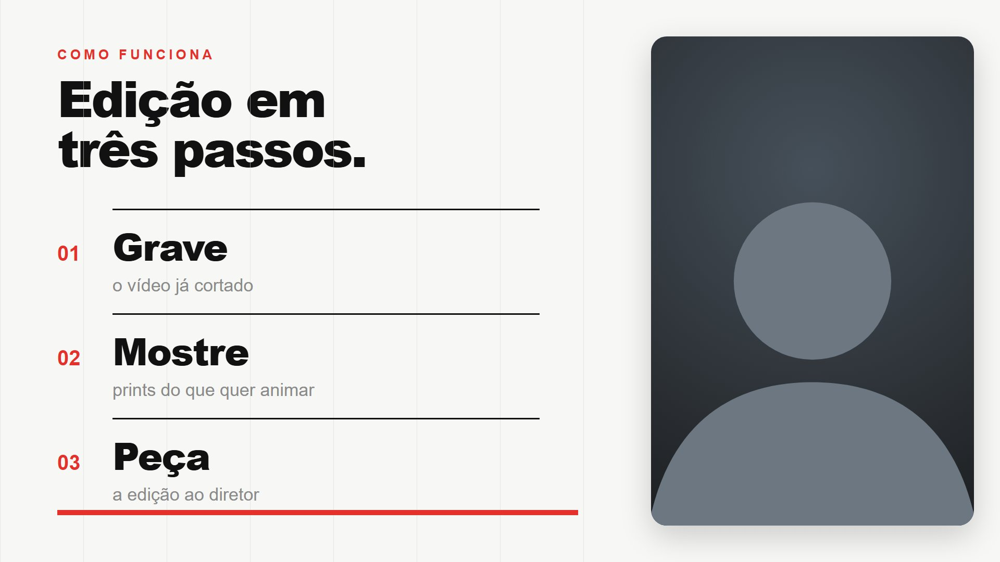
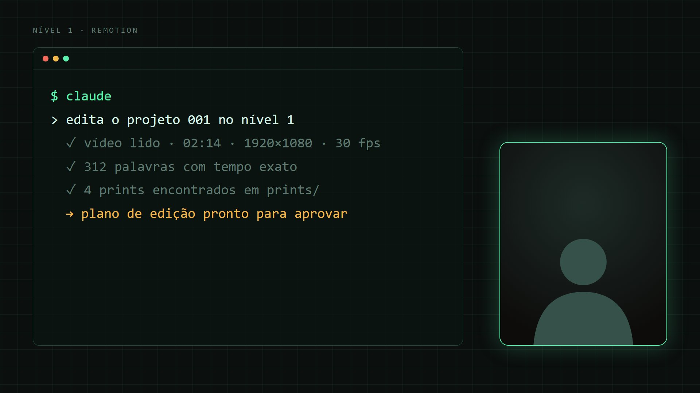
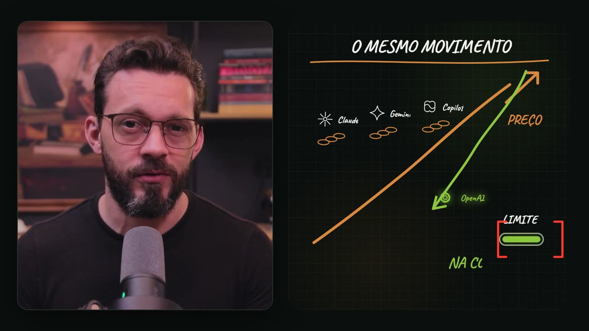
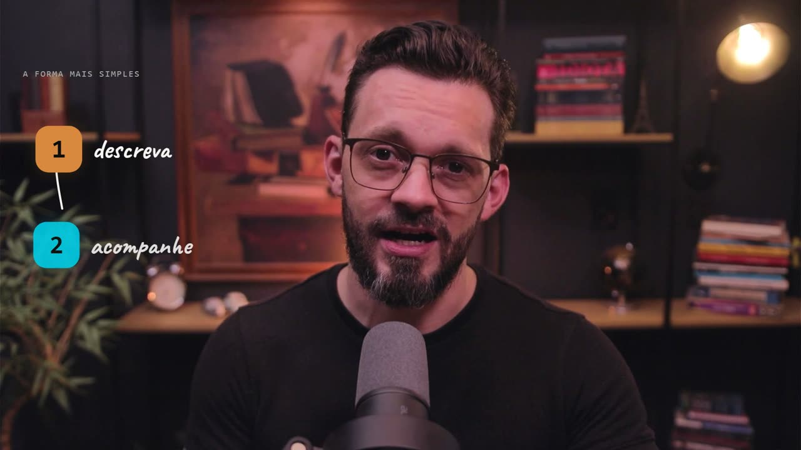
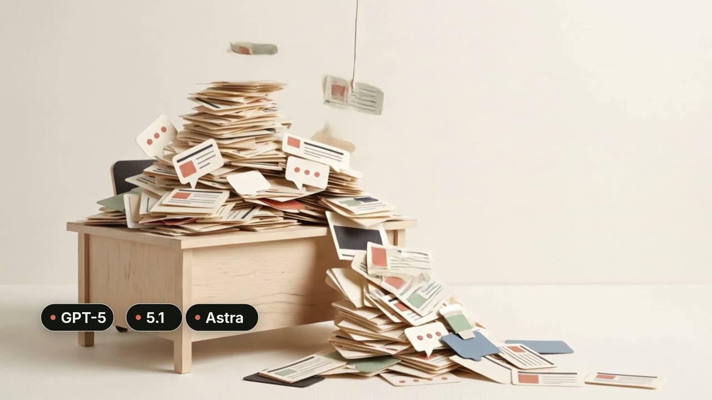

# Style gallery

> Translated from the upstream studio guide `README.md` (estilos/). Talk to the Criadora in pt-BR; this reference is for you.
>
> Paths are relative to her Estúdio folder: the `estudio` skill scaffolds the Remotion template there (`package.json`, `src/`, `remotion.config.ts`), and each Vídeo lives in `projetos/<projeto>/videos/<vídeo>/`. Run `npm` and `npx` with the Node the computer check prints (`tools.node`), from the Estúdio folder. The Criadora never runs these commands herself: you run them, or you tell her in one plain sentence what is missing.

References for the Criadora to choose (or mix) before editing. **No style is mandatory.** She tells Claude which one she likes, asks for variations ("the Swiss minimal, but with a dark background") or brings her own references: she saves screenshots of videos, sites or brands she admires in `prints/` and asks "follow the style of these images".

In the conversation, just cite the style name in bold.

---

## Examples that run on her computer

These five ship with code (the code ships with the Estúdio's Remotion template). Running `npm run studio` in her Estúdio folder shows them in motion. The grey silhouette marks where **her camera** goes.

### Horizontal (16:9)

| | |
|---|---|
|  |  |
| **Minimal suíço.** White background, heavy typography, grid and a single red. Split screen with the camera on the right, entering together with the panel. Good for lessons and step-by-step. | **Terminal técnico.** Dark background with a thin grid, mono font, text typed in real time, camera in a card with a glow. Good for programming, AI and tools. |

### Vertical (9:16) for Reels, TikTok and Shorts

| | | |
|---|---|---|
|  |  |  |
| **Legenda dinâmica.** Full camera, large caption word by word, the spoken word highlighted. | **Print com marca-texto.** The print on top zooms and the highlighter sweeps over the quoted phrase; camera below. | **Dados leves.** Light gradient, a number that counts up to the spoken value, bars that grow; camera in a circle. |

---

## From the original project: Nível 1 (Remotion)

Real frames from videos edited with this workflow on the channel **Macks Wendhell | Inteligência Aplicada**. They are **one** way of doing it, not the default.

| | |
|---|---|
|  |  |
| **Lousa a giz.** Dark board, chalk strokes and handwritten lettering, like a teacher writing while explaining. Camera in a card on the left. | **Editorial quente.** Paper and graphite tones, elegant serif, flows with thin arrows and stock illustrations. |
|  |  |
| **Dossiê claro-escuro.** Alternates light sheets and dark backgrounds, uppercase labels, small camera in the corner. Good for analyses and investigations. | **Técnico neon.** Dark with green and orange outlines, circular diagrams, camera on the right. |
|  |  |
| **Manuscrito colorido.** Elements over the full camera, numbers in colored blocks and handwritten notes. | **Dossiê com marca-texto.** Paper document, magnifying glass, yellow highlighter and a hand-drawn mascot. |

## From the original project: Nível 2 (Higgsfield)

| | |
|---|---|
|  |  |
| **Papel recortado.** B-roll generated in Higgsfield as a paper diorama, with no text; the chips enter in the composition. | **Papel creme em aula.** Cream panel on the left, camera on the right (70/30), cards that assemble with the speech. |
|  | |
| **Cinematográfico escuro.** Realistic B-roll, low light, discreet typography. | |

---

## How to ask for a style

```text
Usa o estilo "terminal técnico", intensidade equilibrada.
```

```text
Mistura o "papel creme em aula" com a legenda dinâmica, em vertical.
```

```text
Coloquei 3 prints do canal X em prints/referencia-*. Segue esse visual.
```
