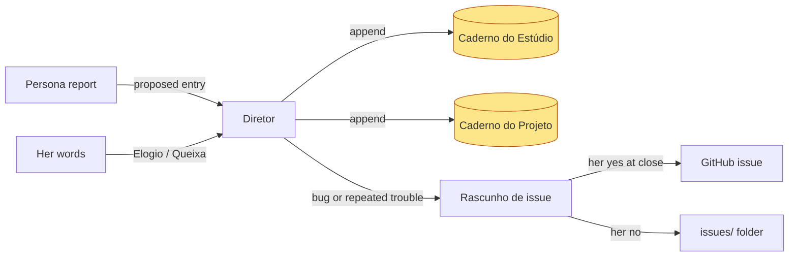

# Caderno

Planned (not built): the studio's memory of how to work with the Criadora, separate from Kit learnings (which change the [Kit](brand-kit-per-front.md)). Decided in the [2026-09-30 grilling](../sources/grilling-caderno-and-social-media-2026-09-30.md); rationale in ADR 0007.

| Aspect | Decision |
|---|---|
| Layers | Estúdio (her, her computer) and one per Projeto (that domain); Diretor picks, default Estúdio |
| Sections | Elogios, Queixas, Soluções |
| Writer | any persona originates in its report; only the Diretor appends, via an `estudio.mjs` command |
| Capture | Diretor spots Elogios/Queixas in her words, writes, tells her in one line |
| Conflicts | new vs old entry: she chooses; Queixa vs Kit: Diretor offers a Kit learning |
| Readers | Diretor at session start; every persona receives both paths |
| Issues | plugin defects and recurring trouble become sanitized Rascunhos de issue, published only after her [Gate](approval-gate.md) at the close |

