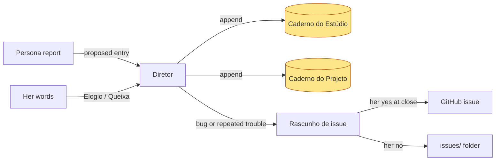

# Caderno

Built in tickets #40 (Caderno) and #43 (issue drafts): the studio's memory of how to work with the Criadora, separate from Kit learnings (which change the [Kit](brand-kit-per-front.md)). Decided in the [2026-09-30 grilling](../sources/grilling-caderno-and-social-media-2026-09-30.md); rationale in ADR 0007.

| Aspect | Decision |
|---|---|
| Layers | Estúdio (her, her computer) and one per Projeto (that domain); Diretor picks, default Estúdio |
| Sections | Elogios, Queixas, Soluções |
| Writer | any persona originates in its report (`caderno-proposto`); only the Diretor writes, via the `estudio.mjs` command `caderno`, as soon as the report arrives (so the next persona of the same Vídeo reads it), telling her in one line per entry |
| Capture | Diretor spots Elogios/Queixas in her words, writes, tells her in one line |
| Conflicts | new vs old entry: she chooses; Queixa vs Kit: Diretor offers a Kit learning |
| Readers | Diretor at session start; every persona receives both paths (`<caderno-estudio>`, `<caderno-projeto>`) and reads them before working |
| Issues | plugin defects and recurring trouble become sanitized Rascunhos de issue (ticket #43), published only after her [Gate](approval-gate.md) at the close |

## Built (ticket #40)

- **Storage.** `caderno.md` at the Estúdio root and `projetos/<projeto>/caderno.md`, created on the first entry, pt-BR markdown with `## Elogios`, `## Queixas` and `## Soluções` and one line per entry: `- **#3** <text> — _<persona>, <Vídeo>, <date>_`. Identifiers are per file and never reused (the next one is kept in a `<!-- proximo: N -->` comment under the title); dates are her local date.
- **CLI `caderno "<folder>" '<json>'`** (`plugin/estudio/scripts/lib/caderno.mjs`): `acao` `anexar` (layer, section, text, persona, optional Vídeo; the command stamps the date), `substituir` (same place, new text and stamp) or `remover`, both by `id`. Layers `estudio`/`projeto`, sections `elogios`/`queixas`/`solucoes`. It refuses with a stable `reason` and changes no file: `unknown-layer`, `unknown-section`, `unknown-projeto`, `unknown-video`, `unknown-entry`, `invalid-input`, `not-estudio`. Whether two entries conflict stays the Diretor's judgement.
- **`estado`** reports `caderno: {caminho, existe}` for the Estúdio and for each Projeto (absolute paths, so the Diretor hands them to personas as they are).
- **Prompts.** The Diretor's skills (`estudio`, `novo-video`, `plano`, `edicao`, with the protocol in `skills/estudio/references/caderno.md`) cover reading, capture with a one-line notice, layer choice, conflict resolution and the Kit learning offer. Every persona prompt has a "The Caderno" section: both paths, read first, and an optional `caderno-proposto` report field.
- Tests: `tests/caderno.test.mjs`, `tests/estado.test.mjs`.

## Rascunhos de issue (ticket #43)

- **Triggers.** A defect in the plugin itself, or a Solução that works round plugin behaviour (`bug`); the internal Crítico loop hitting its three-turn cap on the same rejection code, or the same Solução or Queixa in 2 or more Vídeos counted from the Caderno (`evolucao`). A problem in her environment is only a Solução. The affected persona proposes what process or skill it would need in an optional report field, `evolucao-proposta`; the Diretor decides.
- **CLI `rascunho-issue "<folder>" '<json>'`** (`plugin/estudio/scripts/lib/rascunho-issue.mjs`): `salvar` writes `issues/NNN-<slug>.md` at the Estúdio root (frontmatter: id, tipo, titulo, criadoEm, decisao, decididoEm, url; body: the English issue text); `link` returns the pre-filled `https://github.com/rodrigorjsf/studio/issues/new?title=…&body=…` link (`encodeURIComponent`, so accents and spaces are encoded; `linkCabe` is false past 7,000 characters); `decidir` records `publicado` (with the issue URL), `link-entregue` or `recusado`, once. It refuses a draft whose title or body contains the Estúdio's absolute path or the name of any Projeto or Vídeo (`private-content`, compared composed, lower-cased and with `\` as `/`), also re-checked on `link`. Other refusals: `unknown-kind`, `unknown-draft`, `already-decided`, `invalid-input`, `not-estudio`.
- **`estado`** reports `rascunhosPendentes` (drafts with no decision: `{id, tipo, titulo, arquivo}`); a damaged draft file is an `errors` entry.
- **Gate.** In the edicao skill's close step, beside the Kit learnings: one multi-select question listing the drafts. Never automatic under any Autonomia, and "decide você" approves none. With her yes the Diretor opens the issue with `gh` when it is signed in, else hands her the link; declined drafts stay in `issues/`. The Diretor's protocol is `skills/estudio/references/rascunho-issue.md`.
- Tests: `tests/rascunho-issue.test.mjs`.

